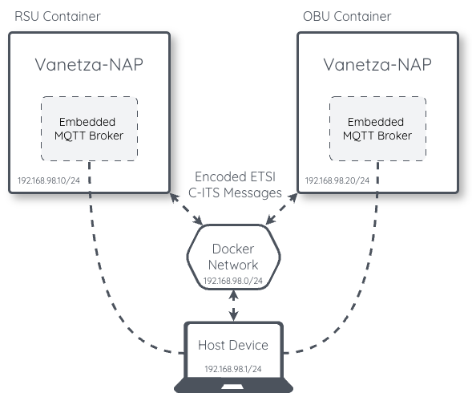

<style>
r { color: Red }
o { color: Orange }
g { color: Green }
</style>

# Simulated Deployment

Vanetza-NAP can be deployed on a single machine using Docker Compose and a virtual Docker network, allowing multiple ITS stations (OBUs and RSUs) to exchange ETSI C-ITS messages without requiring physical ITS-G5 hardware. This is useful for development, testing, and demonstration purposes.



In this setup, each Vanetza-NAP container acts as an independent ITS station with its own Station ID, MAC address, and embedded MQTT broker. The containers communicate over a shared Docker bridge network (`vanetzalan0`), where L2 broadcast frames carry ASN.1-encoded ETSI C-ITS messages — just as they would over a real ITS-G5 radio interface. External applications on the host machine can interact with each station via MQTT.

## Setup

### 1. Create the Docker network

Create the virtual network that the Vanetza containers will use to exchange ETSI C-ITS messages:

```bash
docker network create vanetzalan0 --subnet 192.168.98.0/24
```

### 2. Create the Docker Compose file

Create a `docker-compose.yml` that defines one or more ITS stations. The following example creates an RSU and OBU pair:

```yaml
version: '2.4'
services:
    rsu:
        hostname: rsu
        restart: always
        image: ghcr.io/nap-it/vanetza-nap:release2
        cap_add:
            - "NET_ADMIN"
        environment:
            - VANETZA_STATION_ID=1
            - VANETZA_STATION_TYPE=15
            - VANETZA_MAC_ADDRESS=6e:06:e0:03:00:01
            - VANETZA_INTERFACE=br0
            - VANETZA_USE_HARDCODED_GPS=true
            - VANETZA_LATITUDE=40.637
            - VANETZA_LONGITUDE=-8.652
            - START_EMBEDDED_MOSQUITTO=true
            - SUPPORT_MAC_BLOCKING=true
        networks:
            vanetzalan0:
                ipv4_address: 192.168.98.10

    obu:
        hostname: obu
        restart: always
        image: ghcr.io/nap-it/vanetza-nap:release2
        cap_add:
            - "NET_ADMIN"
        environment:
            - VANETZA_STATION_ID=2
            - VANETZA_STATION_TYPE=5
            - VANETZA_MAC_ADDRESS=6e:06:e0:03:00:02
            - VANETZA_INTERFACE=br0
            - VANETZA_USE_HARDCODED_GPS=true
            - VANETZA_LATITUDE=40.638
            - VANETZA_LONGITUDE=-8.651
            - START_EMBEDDED_MOSQUITTO=true
            - SUPPORT_MAC_BLOCKING=true
        networks:
            vanetzalan0:
                ipv4_address: 192.168.98.20

networks:
  vanetzalan0:
    external: true
```

> <o>**_NOTE:_** Each container must have a unique `VANETZA_STATION_ID`, `VANETZA_MAC_ADDRESS`, and `ipv4_address`. The interface is set to `br0` because the entrypoint creates a bridge when `SUPPORT_MAC_BLOCKING=true`.</o>

### 3. Start the containers

```bash
docker compose up -d
```

To stop:

```bash
docker compose down
```

To check the logs of a specific container:

```bash
docker compose logs obu
docker compose logs rsu
```

## Adding More Stations

To add more stations, duplicate an existing service block in `docker-compose.yml` with unique values:

```yaml
    obu2:
        hostname: obu2
        restart: always
        image: ghcr.io/nap-it/vanetza-nap:release2
        cap_add:
            - "NET_ADMIN"
        environment:
            - VANETZA_STATION_ID=3
            - VANETZA_STATION_TYPE=5
            - VANETZA_MAC_ADDRESS=6e:06:e0:03:00:03
            - VANETZA_INTERFACE=br0
            - START_EMBEDDED_MOSQUITTO=true
            - SUPPORT_MAC_BLOCKING=true
        networks:
            vanetzalan0:
                ipv4_address: 192.168.98.30
```

## Interacting with Stations via MQTT

Each container runs its own embedded MQTT broker. From the host machine, you can interact with any station using its IP address:

```bash
# Subscribe to CAM messages received by the RSU
mosquitto_sub -h 192.168.98.10 -t "vanetza/out/cam" -v

# Subscribe to all messages from the OBU
mosquitto_sub -h 192.168.98.20 -t "vanetza/out/#" -v

# Send a CAM message through the OBU's V2X interface
mosquitto_pub -h 192.168.98.20 -t "vanetza/in/cam" -f examples/in_cam.json
```

Install the mosquitto clients package if needed:

```bash
sudo apt install mosquitto-clients
```

## Simulating Out-of-Range Scenarios

Within the Docker network, all containers always have L2 connectivity with each other. To simulate situations where stations become out of range, Vanetza-NAP uses `ebtables` to dynamically block L2 packets from specific source MAC addresses on a per-container basis.

This requires `SUPPORT_MAC_BLOCKING=true` in the container's environment.

### Blocking a station

```bash
# The OBU stops receiving messages from the RSU
docker compose exec obu block 6e:06:e0:03:00:01

# The RSU stops receiving messages from the OBU
docker compose exec rsu block 6e:06:e0:03:00:02
```

### Unblocking a station

```bash
# The OBU starts receiving messages from the RSU again
docker compose exec obu unblock 6e:06:e0:03:00:01

# The RSU starts receiving messages from the OBU again
docker compose exec rsu unblock 6e:06:e0:03:00:02
```

> <o>**_NOTE:_** On Windows hosts, the MAC blocking feature may not work. In that case, set `VANETZA_INTERFACE=eth0` and `SUPPORT_MAC_BLOCKING=false`.</o>

