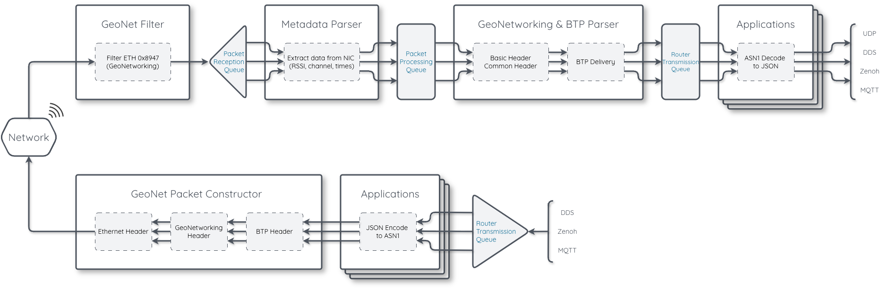

Title: Architecture & Message Flow

<style>
r { color: Red }
o { color: Orange }
g { color: Green }
</style>



## Core Architecture Layers

1. <o>**Link Layer**</o> - Raw Ethernet (ITS-G5) or UDP multicast for over-the-air communication. Handles frame transmission/reception.

2. <o>**GeoNetworking (GN)**</o> - Supports multiple routing modes: SHB (single-hop broadcast), GBC (geo-broadcast), GUC (geo-unicast), TSB (topologically-scoped broadcast). Handles duplicate detection, forwarding decisions, and hop limits. There are N+1 router instances (one per reception thread + one for application timers).

3. <o>**Basic Transport Protocol (BTP)**</o> - Port-based demultiplexing (like UDP ports). Each message type has a dedicated port
(CAM=2001, DENM=2002, etc.). A Port Dispatcher routes incoming packets to the correct application handler.

4. <o>**Security**</o> - Optional layer with three modes: none, dummy, or full certificate-based. Supports signing, verification,
encapsulation, and decapsulation using Crypto++ or OpenSSL backends.

5. <o>**ASN.1 / Facilities**</o> - Encoding/decoding of ITS messages. Supports both UPER (binary, compact) and JER (JSON-based). Handles R1
and R2 protocol versions with auto-detection on decode.


## Pub/Sub & Communication Endpoints

Messages can be ingested and published via four endpoints, all managed by a unified PubSub system:

- MQTT - Local and remote brokers. Topics: ```vanetza/in/{message_type}```, ```vanetza/out/{message_type}```, ```vanetza/own/cam```, etc.
- DDS - Fast DDS, domain-based with configurable participant names.
- Zenoh - With shared memory for efficient IPC, configurable local-only or network-wide.
- UDP - UDP socket to receive JSON. One port for each message type (e.g. CAM → 127.0.0.1:5004)

## Multithreading & Queues

The system decouples the radio receive path from application-level processing through four thread-safe queue stages. Each stage runs in its own thread pool, ensuring that slow operations (e.g., JSON encoding, pub/sub publishing) never block packet reception from the wireless interface.

The number of threads per stage is configurable via `num_threads` in `config.ini` (`-1` = auto, uses `hardware_concurrency / 2`). All queue stages use the same thread count **N**.

### 1. Packet Reception Queue

<o>**Location in diagram**</o>: Between the GeoNet Filter and the GeoNetworking & BTP Parser.

<o>**Implementation**</o>: Single FIFO queue protected by a mutex and condition variable.

<o>**Purpose**</o>: Buffers raw Ethernet frames after initial filtering and metadata extraction, before they are passed to GeoNetworking routing. This decouples the link layer's blocking receive loop from the more expensive GN header parsing and security verification.

<o>**Data flow**</o>:

1. The link layer receive loop (`raw_socket_link.cpp`) blocks on a raw socket read
2. When a frame arrives, a BPF kernel filter discards non-GeoNetworking packets (ethertype != `0x8947`)
3. The Ethernet header is parsed and metadata is extracted: reception timestamp, source MAC, RSSI, MCS rates, and channel information (frequency, noise, busy/rx/tx time ratios)
4. The packet (with metadata) and Ethernet header are pushed into the reception queue
5. <o>**N reception threads**</o> consume from this queue. Each thread has its own dedicated GN Router instance (avoiding lock contention on the hot path). The thread stamps `time_queue` on the packet (used for latency tracking) and calls `router->indicate()` to begin GeoNetworking processing

<o>**Thread allocation**</o>: N consumer threads + 1 additional GN Router instance for application timer events (total: N+1 routers).

### 2. Packet Processing Queue

<o>**Location in diagram**</o>: Between GeoNetworking & BTP Parser and the Applications (labeled "Router Processing Queue" in the diagram).

<o>**Implementation**</o>: Three priority-level queues (`std::deque[3]`) behind a single mutex and condition variable.

<o>**Purpose**</o>: After GeoNetworking routing and BTP port dispatch, decoded packets are queued here for application-level processing (ASN.1 decoding, JSON encoding, pub/sub publishing). This separates the fast GN/BTP parsing from the heavier application logic, and introduces <o>**priority-based scheduling**</o> so that safety-critical messages are processed before informational ones.

<o>**Priority levels**</o> (0 = highest, dequeued first):

| Level | Applications |
|---|---|
| **0** | DENM, CPM (safety-critical) |
| **1** | CAM, VAM, SPATEM, MAPEM (cooperative awareness) |
| **2** | IVIM, MIM, MVM, SSEM, SREM, RTCMEM (informational) |

The priority for each packet is determined by looking up the destination BTP port in a priority map that is populated when applications are registered. The `pop()` method always drains the highest-priority queue first before moving to lower priorities.

<o>**Data flow**</o>:

1. A GN Router thread finishes parsing the GeoNetworking and BTP headers
2. The BTP Port Dispatcher's `IndicationQueue` receives the `DataIndication` and packet
3. It looks up the application's priority via the BTP port and pushes into the corresponding priority-level queue
4. <o>**N processing threads**</o> consume from this shared queue, always servicing priority 0 first
5. The processing thread calls the target application's `indicate()` method, which performs ASN.1 UPER decoding, JER JSON encoding, metadata attachment, and publishing to all enabled pub/sub backends

### 3. Router Transmission Queue

<o>**Location in diagram**</o>: Between the Applications and the GeoNet Packet Constructor (outbound path).

<o>**Implementation**</o>: Six priority-level queues (`std::deque[6]`) behind a single mutex and condition variable.

<o>**Purpose**</o>: Buffers outbound messages arriving from pub/sub endpoints (MQTT, DDS, Zenoh) before they are processed by the application (JSON decoding, ASN.1 encoding) and transmitted over-the-air. The six levels combine application priority with source priority, ensuring that middleware-originated messages (e.g., from a local control application) are prioritized over messages being relayed from another over-the-air source.

<o>**Priority calculation**</o>: `level = application_priority + (3 × source_priority)`

| | Source = Middleware (0) | Source = Over-the-Air (1) |
|---|---|---|
| **App Priority 0** (DENM, CPM) | Level **0** (highest) | Level **3** |
| **App Priority 1** (CAM, VAM, SPATEM, MAPEM) | Level **1** | Level **4** |
| **App Priority 2** (IVIM, MIM, MVM, SSEM, SREM, RTCMEM) | Level **2** | Level **5** (lowest) |

<o>**Data flow**</o>:

1. A pub/sub message arrives (e.g., MQTT `vanetza/in/cam` or DDS/Zenoh equivalent)
2. The PubSub system timestamps the message and pushes it into the transmission queue at the calculated priority level
3. <o>**N transmission threads**</o> consume from this shared queue, always servicing the highest priority first
4. The thread calls the target application's `on_message()`, which performs GPS placeholder substitution, JER JSON decoding, ASN.1 UPER encoding, and sends the packet through the GN Router to the link layer
5. Each transmission thread uses its own GN Router instance (`routers[i]`) to avoid contention

### Queue Behavior Summary

All queues use the same synchronization pattern: non-blocking push (notify one waiting thread) and blocking pop (wait on condition variable until data is available). This means threads sleep efficiently when idle and wake immediately when work arrives.

| Queue | Levels | Push | Pop | Consumers |
|---|---|---|---|---|
| Packet Reception | 1 (FIFO) | Non-blocking | Blocking | N threads |
| Packet Processing | 3 (priority) | Non-blocking | Blocking, priority-ordered | N threads |
| Router Transmission | 6 (priority) | Non-blocking | Blocking, priority-ordered | N threads |

